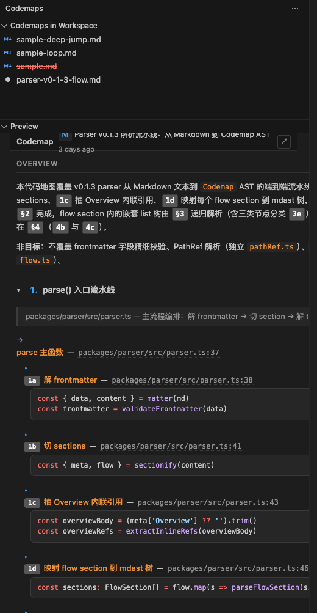

# Codemap Skill

按任务驱动的方式为 coding project 生成 **Call-Path Slice codemap**——单一结构化 Markdown，写入 `<project>/.codemaps/`。产物同时供 Claude `@` 注入和本地 viewer 可视化阅读。

技能定义：[`SKILL.zh.md`](./SKILL.zh.md)
English: [`README.md`](./README.md)

## Demo

<video src="https://github.com/tttinkl/codemaps-skill/releases/download/codemaps-vscode-0.1.0/demo.mp4"
       controls muted playsinline width="800"
       poster="https://raw.githubusercontent.com/tttinkl/codemaps-skill/main/image.png">
  当前阅读器不支持内嵌视频 —
  <a href="https://github.com/tttinkl/codemaps-skill/releases/download/codemaps-vscode-0.1.0/demo.mp4">下载 .mp4</a>。
</video>

## 安装

通过 [skills CLI](https://github.com/obra/skills) 一键安装到本地各类 AI agent（Claude Code / Cursor / Codex / Gemini CLI 等）：

```bash
pnpm dlx skills add tttinkl/codemaps-skill
```

按提示选择目标 agent 即可。

## 使用

激活后，向 AI agent 说：

- "建 codemap" / "/codemap 给 X 流程做一张代码地图" / "帮我理解这条调用链"

agent 会按 SKILL 的 6 阶段流程产出 `.codemaps/<slug>.md`。

## 配套 VS Code 插件

`.codemaps/**/*.md` 可以用 **Codemap Viewer** 插件渲染成交互式调用图（VS Code / Windsurf / Cursor 通用）。

**下载安装**：

1. 前往 [GitHub Releases](https://github.com/tttinkl/codemaps-skill/releases) 下载最新 `.vsix`
2. 用 `.vsix` 的实际路径安装（cd 到下载目录，或写绝对路径）：

   ```bash
   code --install-extension ~/Downloads/codemaps-vscode-<version>.vsix
   ```

   Windsurf / Cursor 用对应的 `windsurf` / `cursor` 命令。

## 基本检查

激活前提（SKILL 自检）：

- [x] 工作目录是 coding project（有源代码，不是文档仓库）
- [x] 已给出任务 / 入口描述（如"登录流程"、"`/api/orders` POST handler"）

任一缺失会先反问，不会盲目开干。

## 截图



## License

MIT
